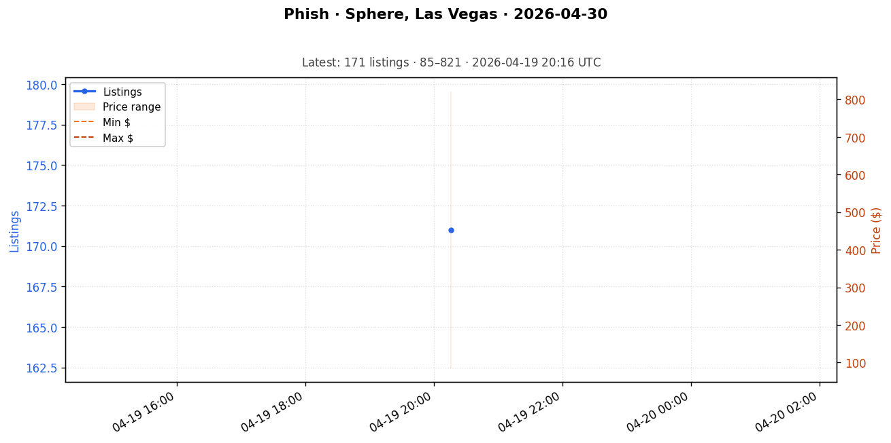

# StubHub Monitor

Tracks the number of tickets listed on StubHub for one hardcoded event and logs the counts to `data.csv` over time.



## What it does

Every time `monitor.py` runs, it:

1. Opens the event page in headless Chromium via Playwright.
2. Tries three extraction strategies in order — regex on the rendered body text, scanning price selectors for min/max, and dumping the `__NEXT_DATA__` JSON blob to `last_next_data.json` for future tuning.
3. Appends a row to `data.csv` with columns `timestamp_utc, count, min_price, max_price, raw_text`.

The event URL is hardcoded at the top of `monitor.py` (`EVENT_URL`). Edit it there to track a different show.

## Run locally

```bash
pip install -r requirements.txt
python -m playwright install chromium
python monitor.py   # append a row to data.csv
python plot.py      # regenerate chart.png
```

## GitHub Action

`.github/workflows/monitor.yml` runs hourly via cron (`0 * * * *`) plus manual dispatch. It installs Playwright with `--with-deps`, runs `monitor.py`, regenerates `chart.png` with `plot.py`, and commits both back to the repo using the `github-actions` bot identity.

If the first run fails to push, enable **Settings → Actions → General → Workflow permissions → Read and write permissions** on the repo.

## How extraction works

The listings page renders client-side, so `monitor.py` waits for `load`, lets the page settle, scrolls to trigger any lazy content, then reads `body` text. It pulls the count from `"Showing N of M"` (or `"N listings"` as a fallback) and the min/max from the price slider (`Price per ticket $X $Y`). If StubHub changes that UI, these regexes are the thing to retune — search for the new strings in the rendered body.

## Note on StubHub ToS

StubHub's terms of service prohibit automated access. Keep the cadence reasonable, don't redistribute the data, and don't build a product on top of it. This is for personal curiosity only.
